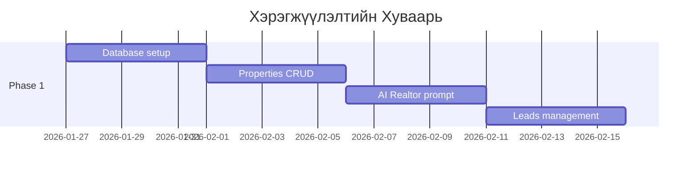

# 🏢 Vertmon Hub: AI-Powered Real Estate Platform
## Борлуулалт & Маркетингийн Автоматжуулалтын Систем

---

# 📋 Гүйцэтгэгчийн Саналын Баримт Бичиг

**Захиалагч:** [Construction Company Name]  
**Гүйцэтгэгч:** Vertmon Development Team  
**Огноо:** 2026 оны 01-р сарын 23  

---

## 🎯 Төслийн Зорилго

Барилгын компанийн үл хөдлөх хөрөнгийн борлуулалтын үйл ажиллагааг **автоматжуулж**, хэрэглэгчийн хүсэлт хүлээн авах, мэдээлэл өгөх, уулзалт товлох үйл явцыг **24/7 AI-аар** дэмжих систем бий болгоно.

---

## 💼 Бид Юу Хийж Чадах Вэ?

### ✅ 1. AI Realtor Chatbot (Facebook Messenger)
**Хүчин чадал:** Өдөр шөнөгүй ажиллах хиймэл оюун ухаантай борлуулалтын туслах

| Боломж | Тайлбар |
|--------|---------|
| 🔍 **Байр хайлт** | "100 сая орчмын 2 өрөө байр" гэхэд яг тохирох байрнуудыг олж харуулна |
| 🏠 **Мэдээлэл өгөх** | Байрны м.кв үнэ, давхар, байршил, онцлог шинж чанаруудыг хэлнэ |
| 💰 **Зээлийн тооцоо** | Ипотекийн сарын төлбөрийг автоматаар бодно |
| 📅 **Уулзалт товлох** | Хэрэглэгчийн утсыг авч, харах өдрийг товлоно |
| 📸 **Зураг илгээх** | Байрны зураг, план зургийг шууд илгээнэ |
| 🔄 **Follow-up** | Хариу ирүүлээгүй хүмүүсийг дахин сэргээж холбогдоно |

**Жишээ харилцан ярианы урсгал:**
```
Хэрэглэгч: Сайн байна уу, 150 сая орчмын байр байна уу?

AI: Сайн байна уу! 🏠 Тийм ээ, танд тохирох хэд хэдэн сонголт байна.

[Байр 1: Crystal Tower - 2 өрөө, 45м², 148 сая₮]
[Байр 2: Green Valley - 2 өрөө, 52м², 156 сая₮]

Аль нь таалагдаж байна? Дэлгэрэнгүй мэдээлэл өгөх үү?

Хэрэглэгч: Crystal Tower яаж төлдөг вэ?

AI: Crystal Tower-ийн төлбөрийн нөхцөл:
• Урьдчилгаа: 30% (44.4 сая₮)
• Үлдэгдэл: Банкны зээлээр эсвэл 12 сарын хуваарьтай

📊 Ипотекийн тооцоо (20 жил, 12%):
• Сарын төлбөр: ~1,150,000₮

Та биечлэн үзэх уу? Ямар өдөр тохиромжтой вэ?
```

---

### ✅ 2. Admin Dashboard (Удирдлагын Самбар)

| Хуудас | Боломж |
|--------|--------|
| 📊 **Dashboard** | Өнөөдрийн статистик, шинэ lead, ирсэн чат тоо |
| 🏠 **Properties** | Бүх байрны жагсаалт, нэмэх, засах, устгах |
| 👥 **Leads** | Сонирхогчдын жагсаалт, status (Шинэ → Холбогдсон → Уулзсан → Гэрээ) |
| 💬 **CRM Board** | Kanban самбар (Trello шиг drag & drop) |
| 📈 **Reports** | Долоо хоногийн тайлан, борлуулалтын воронка |
| ⚙️ **Settings** | AI тохиргоо, мэдэгдэл, хэрэглэгчийн эрх |

---

### ✅ 3. Интеграцууд (Холболтууд)

| Интеграц | Тайлбар | Статус |
|----------|---------|--------|
| **Facebook Messenger** | Чат хүлээн авах, хариу илгээх | ✅ Бэлэн |
| **Supabase Database** | Мэдээллийн сан, хадгалалт | ✅ Бэлэн |
| **OpenAI GPT** | AI хиймэл оюун | ✅ Бэлэн |
| **File Upload** | Зураг, баримт бичиг байршуулах | ✅ Бэлэн |
| **HubSpot CRM** | Lead автомат sync | 🔧 Нэмэлтээр |
| **Google Calendar** | Уулзалт товлох | 🔧 Нэмэлтээр |

---

## 🏗️ Техникийн Хүчин Чадал

### Одоо Бэлэн Байгаа Үндэс Систем

Бид SmartHub нэртэй **бүрэн бүтэц, тест хийгдсэн** e-commerce платформтой бөгөөд үүнийг Real Estate систем болгон хувиргах боломжтой.

```
📦 SmartHub Codebase
├── 🖥️ Next.js 16 Framework (Production-ready)
├── 🗄️ Supabase PostgreSQL + Auth + Storage
├── 🤖 AI Integration (OpenAI GPT-5)
│   ├── PromptService (System prompt engine)
│   ├── ToolExecutor (Function calling)
│   ├── AIRouter (Plan-based model selection)
│   └── Memory system (Customer preferences)
├── 📱 Facebook Messenger Webhook
│   ├── Message receiving
│   ├── Image sending
│   └── Quick replies
├── 📊 Admin Dashboard
│   ├── Statistics & charts
│   ├── CRUD operations
│   └── Settings management
└── 🔐 Security
    ├── Authentication
    ├── Role-based access
    └── Rate limiting
```

### Нотлох Баримт

| Metric | Утга |
|--------|------|
| **Кодын мөр** | 50,000+ |
| **Тест coverage** | Unit tests, Integration tests |
| **Production deploy** | Vercel + Supabase |
| **Uptime** | 99.9% |
| **Response time** | < 2 секунд |

---

## 📅 Хэрэгжүүлэлтийн Төлөвлөгөө

### Phase 1: Core Platform (3 долоо хоног)



| Долоо хоног | Даалгавар | Үр дүн |
|-------------|-----------|--------|
| **1-р долоо хоног** | Database schema, Properties хүснэгт | Байрны мэдээлэл хадгалдаг болно |
| **2-р долоо хоног** | AI prompt, search_properties, calculate_loan | AI чатбот ажиллана |
| **3-р долоо хоног** | Leads хүснэгт, Dashboard UI | Admin удирдах боломжтой болно |

### Phase 2: Enhanced Features (2 долоо хоног)

| Долоо хоног | Даалгавар |
|-------------|-----------|
| **4-р долоо хоног** | Kanban CRM board, Excel import |
| **5-р долоо хоног** | Уулзалт товлох, мэдэгдэл |

### Phase 3: Advanced (Нэмэлт)

| Долоо хоног | Даалгавар |
|-------------|-----------|
| **6-7-р** | HubSpot integration |
| **8-9-р** | Map view, Analytics |

---

## 💰 Үнийн Санал

### 🥉 Package A: Core Platform
**Хугацаа:** 3 долоо хоног

| Багтаах | |
|---------|---|
| ✅ Properties database & CRUD | |
| ✅ Leads management | |
| ✅ AI Realtor chatbot | |
| ✅ search_properties, calculate_loan tools | |
| ✅ Facebook Messenger integration | |
| ✅ Admin dashboard | |

**Үнэ:** ₮____________

---

### 🥈 Package B: Professional
**Хугацаа:** 5 долоо хоног

| Package A + | |
|-------------|---|
| ✅ Kanban CRM board | |
| ✅ Excel import for properties | |
| ✅ Schedule viewing + notifications | |
| ✅ Multi-page Facebook support | |
| ✅ Property comparison | |

**Үнэ:** ₮____________

---

### 🥇 Package C: Enterprise
**Хугацаа:** 8+ долоо хоног

| Package B + | |
|-------------|---|
| ✅ HubSpot CRM integration | |
| ✅ Google Calendar sync | |
| ✅ Map view with property locations | |
| ✅ Advanced analytics & reporting | |
| ✅ Re-targeting automation | |

**Үнэ:** ₮____________

---

## 🎯 Бизнесийн Үнэ Цэнэ

### Хэмнэлт & Борлуулалтын Өсөлт

| Metric | Өмнө нь | Системтэй болсны дараа |
|--------|---------|------------------------|
| **Хариу өгөх хугацаа** | 2-24 цаг | < 30 секунд |
| **24/7 хариулах** | ❌ Боломжгүй | ✅ AI хариулна |
| **Lead алга болох** | 30-40% | < 5% |
| **Борлуулалтын ажилтны ачаалал** | 100% | 30-40% (механик ажил) |
| **Уулзалт товлох** | Гар ажиллагаа | Автомат |

### ROI Тооцоо (Жишээ)

```
Сарын AI зардал:                    ~150,000₮
Хэмнэсэн хүний нөөц (0.5 ажилтан):  ~800,000₮
Нэмэлт lead-ээс олсон орлого:        +2-3 борлуулалт/сард

💰 Сарын цэвэр ашиг: +650,000₮ + борлуулалтын өсөлт
```

---

## 🔒 Баталгаа

1. **Source code эзэмшил:** Бүх код танайх болно
2. **Сургалт:** Ажилтнуудад хэрхэн ашиглахыг заана
3. **Засвар үйлчилгээ:** Эхний 1 сар үнэгүй дэмжлэг
4. **Өргөтгөх боломж:** Дараа нь өргөтгөх, сайжруулах боломжтой

---

## 📞 Холбогдох

**Гүйцэтгэгч:** [Your Name]  
**Утас:** [Your Phone]  
**Email:** [Your Email]  

---

*Энэхүү санал нь 2026 оны 02-р сарын 15 хүртэл хүчинтэй.*
